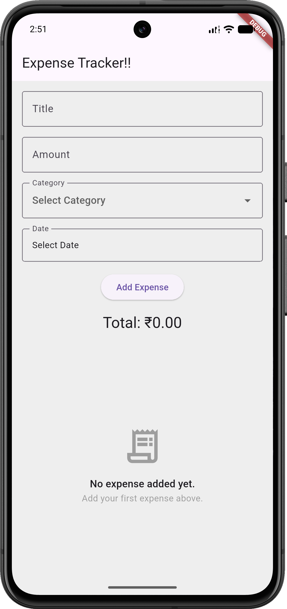
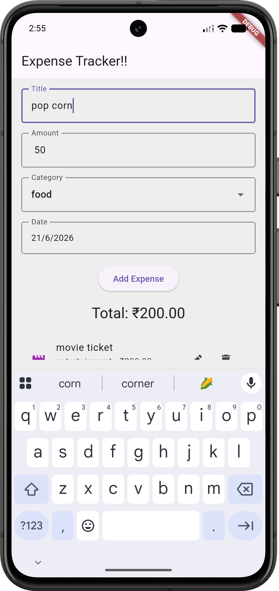
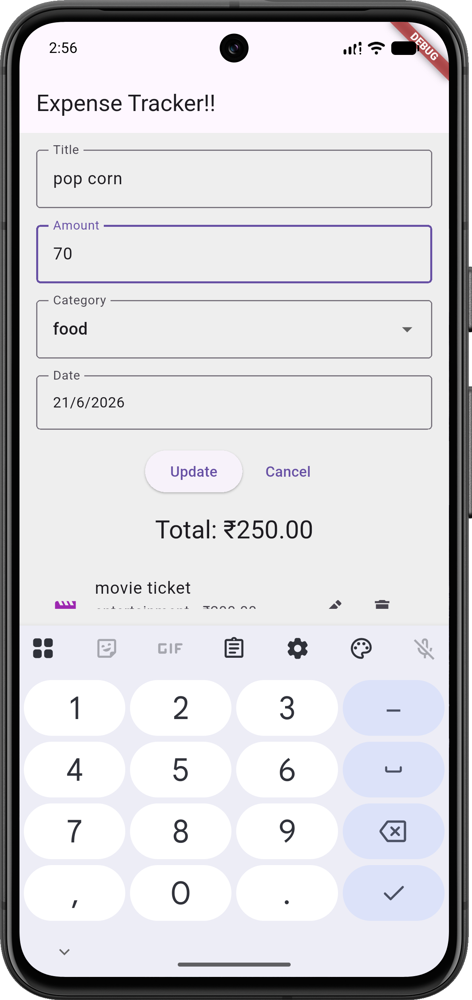
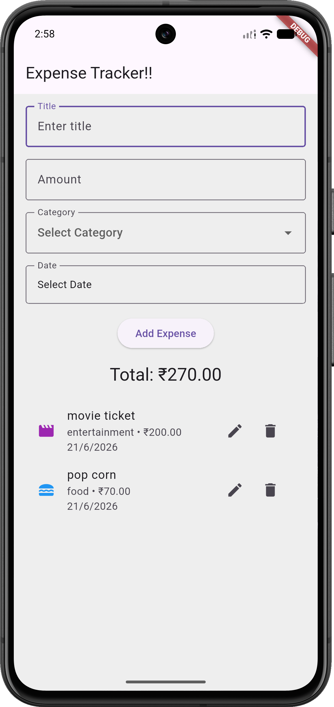

# Expense Tracker

A simple Flutter expense tracking application built for learning Flutter fundamentals, state management, form handling, widget extraction, and local application architecture.

## Features

* Add expenses
* Edit expenses
* Delete expenses
* Categorize expenses
* Select expense dates using a date picker
* View total expenses
* Empty state UI when no expenses exist
* Form validation
* Update and cancel edit mode
* Category icons using enhanced enums

## Categories

* Food
* Travel
* Shopping
* Entertainment
* Health
* Others

## Concepts Practiced

### Flutter

* StatefulWidget
* StatelessWidget
* TextEditingController
* ListView.builder
* DropdownButtonFormField
* Date Picker
* InputDecorator
* InkWell
* Widget extraction
* Parent-child communication
* Callback functions

### Dart

* Classes and objects
* Constructors
* Enums
* Enhanced enums
* Getters
* Null safety
* DateTime
* Futures
* async / await

### Architecture

* Model-driven UI
* Single source of truth
* Form state management
* CRUD operations
* Reusable widgets
* Separation of concerns

## Screenshots
<div style="display: flex; gap: 10px;">
    
    
    
    
</div>>
Add screenshots here after uploading them to the repository.

## Future Improvements

* Local persistence using SharedPreferences
* SQLite / Hive / Isar integration
* Expense filtering
* Category-wise summaries
* Charts and analytics
* Multi-screen navigation
* Search functionality

## Getting Started

```bash
git clone <repository-url>
cd expense_tracker
flutter pub get
flutter run
```

## Learning Goal

This project was built as part of a Flutter learning journey focused on understanding Flutter fundamentals before moving to advanced state management and larger application architectures.
